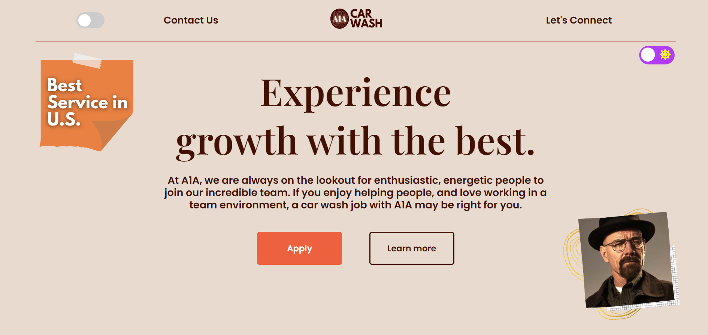
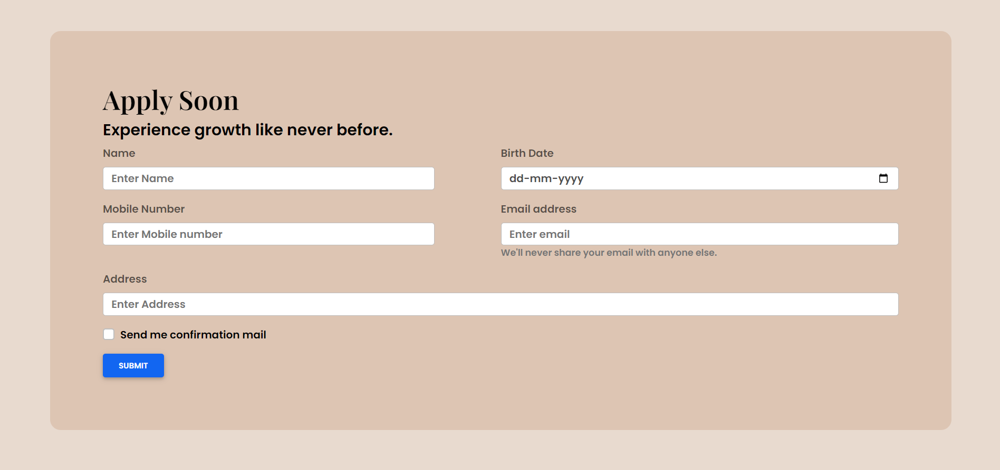
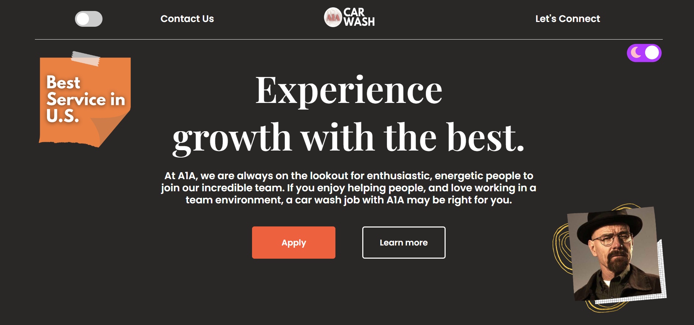
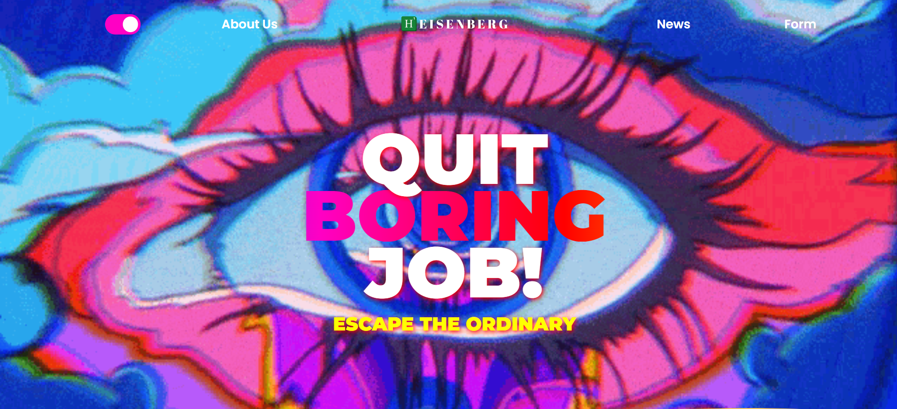
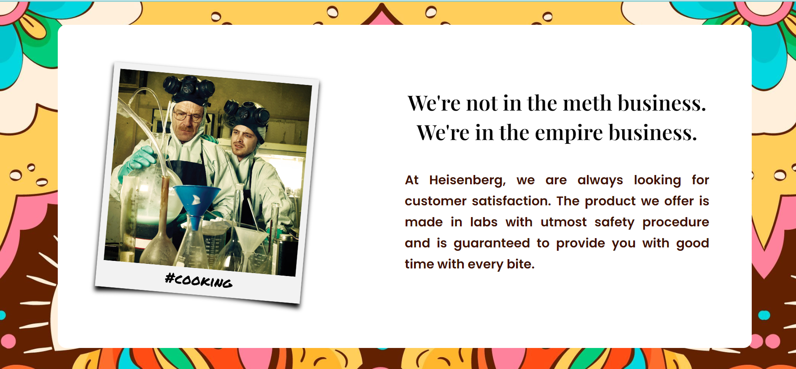

# bb_front_enders

bb_front_endersss is a frontend project for the Inspect Element Competition by Sies, Nerul. 
It is based on the theme Breaking Bad Series.  
It is a front-end focused website with a switch to shift between a Car wash application website to a drug business website.
## Scenario
When Walter starts his partnership with Jesse, he wants more men in his Empire. Help Walter to hire employees for the same.
## Features

- Light/dark mode toggle
- Submission form
- Secret webpage on toggle
- Breaking Bad news

## Screenshots

## Authors

- [Aaryan Rastogi](https://www.github.com/aaryan246)
- [Karishma Rajput](https://www.github.com/karishmarajput)

